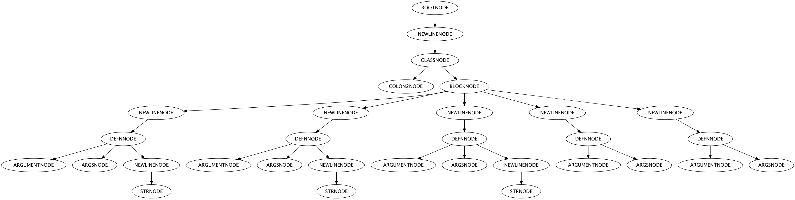

# graaaph

graaaph is a Clojure library designed to make it easy to consume, manipulate, and analyze JRuby's AST representation of Ruby code from Clojure. It ties together a bunch of interesting Clojure libraries in the hopes of creating a unified Clojure toolkit for exploring generated Ruby ASTs.

Ruby code is parsed and transformed by the Java <a href="https://github.com/jruby/jruby-parser">jruby-parser</a> library, manipulated by Clojure's <a href="http://clojuredocs.org/clojure_core/clojure.zip/">zipper library</a>, analyzed with <a href="https://github.com/clojure/core.logic">core.logic</a>, and visualized using @ztellman's <a href="https://github.com/ztellman/rhizome">Rhizone</a>.

## Usage

Get code as a map, with a lot of data:

```clojure
(use 'graaaph.core)

(parse-ruby-code "def a;'ok';end")

;; {:position {:file "", :start-line 0, :end-line 0, :start-offset 0, :end-offset 14}, :type "ROOTNODE", :value nil, :name nil}
;; {:position {:file "", :start-line 0, :end-line 0, :start-offset 0, :end-offset 14}, :type "NEWLINENODE", :value nil, :name nil}
;; {:position {:file "", :start-line 0, :end-line 0, :start-offset 0, :end-offset 14}, :type "DEFNNODE", :value nil, :name "a"}
;; {:position {:file "", :start-line 0, :end-line 0, :start-offset 4, :end-offset 5}, :type "ARGUMENTNODE", :value nil, :name "a"}
;; {:position {:file "", :start-line 0, :end-line 0, :start-offset 6, :end-offset 6}, :type "ARGSNODE", :value nil, :name nil}
;; {:position {:file "", :start-line 0, :end-line 0, :start-offset 6, :end-offset 11}, :type "NEWLINENODE", :value nil, :name nil}
;; {:position {:file "", :start-line 0, :end-line 0, :start-offset 6, :end-offset 10}, :type "STRNODE", :value nil, :name nil}
```

Or as a zipper, but still tasting like Java:

```clojure
(use 'graaaph.core)

(-> (ruby-code-zipper "1")
    z/next
    z/next
    z/node
    .getValue) ;; From the jruby-parser API
;; 1
```

Or use one of a (slowly) growing number of `core.logic` relations:

```clojure
(def ruby-code "class Dude
                  def awesome
                    'first awesome'
                  end
                  #
                  def cool
                    'not awesome'
                  end
                  #
                  def awesome
                    'second awesome'
                  end
                  #
                  def bro
                  end
                  #
                  def bro
                  end
                end")

(defn get-duplicate-method-names [ruby-code]
  (let [ruby-data   (parse-ruby-code ruby-code)
        ast-as-list (for [d ruby-data
                           :when (and (seq (:name d))
                                      (= "DEFNNODE" (:type d)))]
                      [(:name d) (:type d)])
        results     (l/run* [q]
                      (l/fresh [ls dupes]
                        (l/== ls ast-as-list)
                        (dupeo ls dupes)
                        (l/== dupes q)))]
    results))

(get-duplicate-method-names ruby-code)
;; => ((["awesome" "DEFNNODE"] ["bro" "DEFNNODE"]))

;; Examine your ast by generating an image of the tree
(view-ruby-ast ruby-code)

;; or save it as a file
(save-ruby-ast-image ruby-code "tree.png")
```



## Tests

`lein test`

## License

Copyright © 2013 Michael R. Bernstein

Distributed under the Eclipse Public License, the same as Clojure.
